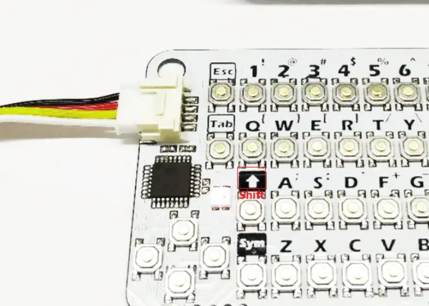
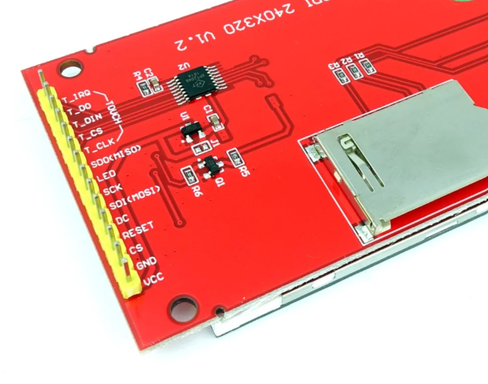
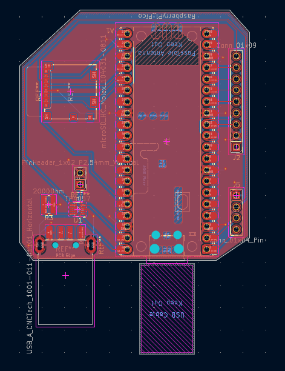
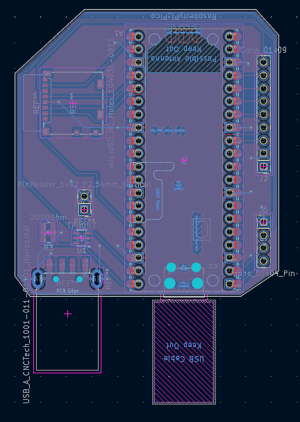
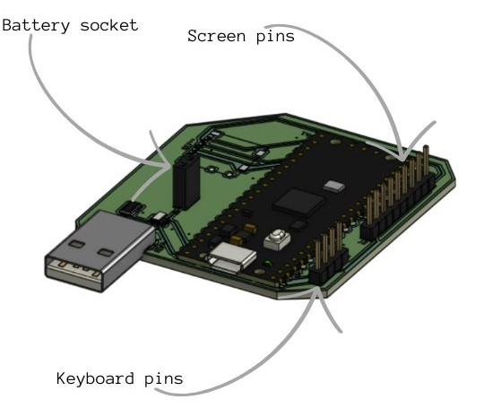

## Weronika's Hacktool

A Raspberry pi Pico based hardware tool that can be plugged in via USB-A or or a connecting wire between raspberry's pi pico and a device that you're connecting it to.

## 3D model on onshape:

https://cad.onshape.com/documents/8ba63a7496dc739681835abf/w/b2486c84e183ee5c75462b5f/e/727d0ff90b4b33300ac8e23b?renderMode=0&uiState=6a1f47a38e48adf890f3cb43

## Specifics
Raspberry pi pico is powered by a LiPo battery, that is charged through USB-A and the voltage that pico receives is controled by the power manager. 
1. specifics to connecting hardware parts
   a) battery:
      - connect it with a male to male wire to a connector pin socket 01x02
   
   b) keyboard (look at connector pins on conn_01x04 from KiCad view), (use female to female wires)
     - Pin1 -> wire -> the pin in the keyboard port that the black wire from the picture goes into
     - Pin2 -> wire -> the pin in the keyboard port that the red wire from the picture goes into
     - Pin3 -> wire -> the pin in the keyboard port that the white wire from the picture goes into
     - Pin4 -> wire -> the pin in the keyboard port that the yellow wire from the picture goes into

    c) screen (use female to female wires)(look at connector pins on conn_01x09 from KiCad view)
      - Pin1 -> wire -> vcc on the screen
      - Pin2 -> wire -> GND on the screen
      - Pin3 -> wire -> CS on the screen
      - Pin4 -> wire -> SDO(MISO) on the screen
      - Pin5 -> wire -> SCK on the screen
      - Pin6 -> wire -> SDI(MOSI) on the screen
      - Pin7 -> wire -> DC on the screen
      - Pin8 -> wire -> LED on the screen

  

## Features

-Raspberry pi Pico
-SD card port (microSD_HC_Molex_104031-0811)
-USB-A (USB_A_CNCTech_1001-011-01101_Horizontal)
-2000 Ohm resistor
-Power manager (TP4057)
-LCD display 
-Keyboard
-LiPo Battery
-Connectors on PCB for screen, keyboard and battery conection

## PCB 
Designed in KiCad, through pico's USB using REPL, pico can send commands to pluged pc and receive and print output, and through UART it can monitor traffic. Independently it can serve as a calculator or a text editor.

**PCB's front copper layer view in KiCad**

**PCB's back copper layer view in KiCad**

**PCB's 3D model, with exact location of specific connectors**

## Schematic

## BOM:

|Item              |Cost |Link |Quantity|
|Raspberry Pi Pico |4.94 USD | https://botland.com.pl/moduly-i-zestawy-do-raspberry-pi-pico/18767-raspberry-pi-pico-rp2040-arm-cortex-m0-0617588405587.html |1|
Micro SD card ?port? , 2.56 USD , https://pl.farnell.com/molex/104031-0811/connector-micro-sd-8pos/dp/2678573?srsltid=AfmBOop4cjIzaVu8hfIHMP871mYQuhebv0rEr_-Nvpk_wUB1qu24MNZC ,1,
USB_A , 0.86 USD , https://www.digikey.pl/pl/products/detail/cnc-tech/1001-011-01101/3064739?srsltid=AfmBOorIKRMa4xjH2wBGTeFGlcepA0Hn9P8wviLBaRUREZm50Ef58_zC ,1,
TP4057 battery charger , 0.82 USD , https://allegro.pl/produkt/tp4057-battery-charger-1af03e5b-a3f5-4e60-a73b-e6587dc6ee7f?offerId=17890124524 ,1,
Keyboard CardKB V1.1 ATmega8A , 10.63 USD ,https://botland.com.pl/moduly-unit-moduly-rozszerzen/21897-mini-klawiatura-keyboard-cardkb-v11-atmega8a-modul-rozszerzen-unit-do-modulow-deweloperskich-m5stack-u035-b-6972934173782.html ,1,
PIN HEADER 1x40 , 1.64 USD , https://allegro.pl/produkt/zlacze-szpilkowe-pin-header-1x40-h-30mm-rm-2-54mm-7a350a7e-0498-4583-8c29-9f037f3ad1fc?offerId=7931790327 ,1,
Dissplay LCD 2.8" 320x240px ST7789 SPI , 10.63 USD , https://elektroweb.pl/pl/wyswietlacze-lcd/1285-wyswietlacz-lcd-28-240x320-st7789-spi-dotykowy-slot-microsd.html?gad_source=1&gad_campaignid=22555279180&gbraid=0AAAAADsUy2ae0J2IuCop7viUUO1lpP-GK&gclid=Cj0KCQjw_vnQBhCxARIsADcZyxKuev4wqrsB1S3inf3nmBAkbw_49dFTvfmAAMxfGj9tlz8YN0hcKHgaAi5PEALw_wcB ,1,
LiPo 1000mAh 3.7V battery , 6.26 USD , https://botland.com.pl/akumulatory-li-pol-1s-37v/15613-akumulator-li-pol-akyga-1000mah-1s-37v-zlacze-jst-bec-gniazdo-48x30x7mm-5904422324230.html ,1,
Male to male wire for the battery , 1.18 USD , http://abc-rc.pl/pl/products/przewody-kable-zworki-dupont-m-m-40-szt-10cm-mesko-meskie-18982.html , 1,
Female to female wire for keyboard and screen , 1.35 USD , https://botland.com.pl/przewody-polaczeniowe-zensko-zenskie/19948-przewody-polaczeniowe-zensko-zenskie-justpi-10cm-40szt-5904422328672.html ,1,

## detailed description on how to use

1. download firmware for pico, and pc
2. download Thonny
3. works best with an sd card connected
4. before assembling everything in the box:
   - plug raspberry pico via wire to your pc
   - push firmware files onto pico
5. to stop any program at any time press esc
6. in order to use the REPL program, or UART:
   - connect pico to at least the screen, and and keyboard
   a) for REPL:
      - in the terminal type "repl"
      - then type the command that you wish to run in your pluged device
     - pico is programed to always run in administrator mode in your pc's cmd so, in order for the rogram to run as intended you must allow it on your pc
    b) for UART:
      -in the terminal type "uart"
7. to use the hacktool independently:
   - connect the pcb to keyboard, screen, and battery
   - charge the battery via USB-A
   a) to use the text editor:
      - type in the terminal "text" + your filename (it can be already saved on sd card or can be created by this command)
        if the file exists:
          - to edit the file type "edit"
          - to delete type "delete"
          - if you change your mind and you no longer wish to engage with the text editor type "leave"
        if it doesn't:
          - type "create" to create it and open it
          - type "leave" if you don't wish to create
8. if you forgot any of those commands type "help" in the main terminal

## why i build this:
I wanted to understand computers and cybersecurity better, i specifically used REPL as i thought it is one of the most universal hacking abilites of raspberry pi pico, I first decided uppon pico because it was all over my feed on tiktok but as it actually turns out it was the perfect fit for my project

## credits:
image from the magazine page, originally distributed by kylatcarter on pinterest: https://pl.pinterest.com/pin/1135399756078582773/ 
readme structure inspired by notaroomba from github

        
